# Feature Guide: Advanced Query Engine (Saved Query Rules)

## Table of Contents

- [Developer Quick Reference Guide](#developer-quick-reference-guide)
- [Query Builder System & Query Processor (Saved Query Rules - Advanced Queries)](#query-builder-system--query-processor-saved-query-rules---advanced-queries)
  - [Overview](#overview)
  - [Architecture Diagram](#architecture-diagram)
    - [System Context Diagram](#system-context-diagram)
    - [Sequence Diagram (Typical Query Request)](#sequence-diagram-typical-query-request)
    - [Sequence Diagram (Saving a Query)](#sequence-diagram-saving-a-query)
  - [Data Flow](#data-flow)
    - [Query Building (UI)](#query-building-ui)
    - [Executing Query (UI -> Backend)](#executing-query-ui---backend)
    - [Query Processing (Backend)](#query-processing-backend)
    - [Database Execution & Response (Backend -> UI)](#database-execution--response-backend---ui)
    - [Saving Query (UI -> Backend)](#saving-query-ui---backend)
  - [Schema / Models](#schema--models)
    - [Key Backend Models (`structs/data_models.go`, `services/rules/structs.go`)](#key-backend-models-structsdata_modelsgo-servicesrulesstructsgo)
    - [Key Frontend Models (`types/api_interfaces.ts`, `types/common_types.ts`)](#key-frontend-models-typesapi_interfacests-typescommon_typests)
    - [Entity-Relationship Diagram (Simplified)](#entity-relationship-diagram-simplified)
  - [API Endpoints / SQL Snippets](#api-endpoints--sql-snippets)
    - [API Endpoints (`routes/routes.go`, `services/rules/controller.go`)](#api-endpoints-routesroutesgo-servicesrulescontrollergo)
- [Threshold Monitoring Workflow (Saved Query Rules - Monitoring Rules)](#threshold-monitoring-workflow-saved-query-rules---monitoring-rules)
  - [Overview](#overview-1)
  - [Architecture Diagram](#architecture-diagram-1)
    - [System Context Diagram](#system-context-diagram-1)
    - [Sequence Diagram (Configuring a Monitoring Rule)](#sequence-diagram-configuring-a-monitoring-rule)
    - [Sequence Diagram (Record Triggering Monitoring Check)](#sequence-diagram-record-triggering-monitoring-check)
  - [Data Flow](#data-flow-1)
    - [Configuration (Admin UI → Backend)](#configuration-admin-ui--backend)
    - [Record Lifecycle Triggers & User Feedback (User Action → Backend)](#record-lifecycle-triggers--user-feedback-user-action--backend)
    - [Monitoring Check Details (Backend)](#monitoring-check-details-backend)
    - [Warning Display (Backend → UI)](#warning-display-backend--ui)
  - [Schema / Models](#schema--models-1)
    - [Key Backend Models (`structs/data_models.go`, `services/rules/structs.go`)](#key-backend-models-structsdata_modelsgo-servicesrulesstructsgo-1)
    - [Key Frontend Models (`types/api_interfaces.ts`, `types/common_types.ts`)](#key-frontend-models-typesapi_interfacests-typescommon_typests-1)
    - [Entity-Relationship Diagram (Monitoring Context)](#entity-relationship-diagram-monitoring-context)
  - [API Endpoints / SQL Snippets](#api-endpoints--sql-snippets-1)
    - [API Endpoints (`routes/routes.go`, `services/rules/controller.go`)](#api-endpoints-routesroutesgo-servicesrulescontrollergo-1)
    - [SQL Snippets](#sql-snippets)
  - [Configuration Parameters](#configuration-parameters)
- [Duplicate Detection Rules (Saved Query Rules - Duplicate Detection Rules)](#duplicate-detection-rules-saved-query-rules---duplicate-detection-rules)
  - [Overview](#overview-2)
  - [Architecture Diagram](#architecture-diagram-2)
    - [System Context Diagram](#system-context-diagram-2)
    - [Sequence Diagram – Configuring a Duplicate Detection Rule](#sequence-diagram--configuring-a-duplicate-detection-rule)
    - [Sequence Diagram - Record Triggering Duplicate Detection Check](#sequence-diagram---record-triggering-duplicate-detection-check)
  - [Data Flow – Duplicate Detection Rules](#data-flow--duplicate-detection-rules)
    - [Configuration (Admin UI -> Backend)](#configuration-admin-ui---backend-1)
    - [Record Trigger (User Action -> Backend)](#record-trigger-user-action---backend)
  - [Duplicate Detection Check (Backend)](#duplicate-detection-check-backend)
  - [Warning Display (Backend -> UI)](#warning-display-backend---ui-1)
  - [Schema / Models](#schema--models-2)
    - [Key Backend Models (`structs/data_models.go`, `services/rules/structs.go`)](#key-backend-models-structsdata_modelsgo-servicesrulesstructsgo-2)
    - [Key Frontend Models (`types/api_interfaces.ts`, `types/common_types.ts`)](#key-frontend-models-typesapi_interfacests-typescommon_typests-2)
  - [API Endpoints / SQL Snippets](#api-endpoints--sql-snippets-2)
    - [API Endpoints (`routes/routes.go`, `services/rules/controller.go`)](#api-endpoints-routesroutesgo-servicesrulescontrollergo-2)
    - [SQL Snippets (`services/rules/processor.go`)](#sql-snippets-servicesrulesprocessorgo)
  - [Configuration Parameters](#configuration-parameters-1)

---

### NOTE: [Create a free mermaid chart account via the playground here](https://www.mermaidchart.com/play?utm_source=mermaid_live_editor&utm_medium=toggle) so you can view and edit the diagrams below.

---

## Developer Quick Reference Guide

If you don't want to or don't have time to read the rest of this documentation, then here is a quick reference guide in a table that classifies the four types of Saved Query Rules below:

1. Advanced Queries
2. Threshold Monitoring Rules
3. Duplicate Detection Rules
4. Custom Data Export

| Field Name                             | Advanced Queries (RuleType: "advanced_query")                                                                                                                                              | Threshold Monitoring Rules (RuleType: "criteria")                                                                                   | Duplicate Detection Rules (RuleType: "column")                                                                                                                                                                                                                                                                                                                                       | Data Exports (RuleType: "export")                                                                                                   |
| -------------------------------------- | ------------------------------------------------------------------------------------------------------------------------------------------------------------------------------------------ | ----------------------------------------------------------------------------------------------------------------------------------- | ------------------------------------------------------------------------------------------------------------------------------------------------------------------------------------------------------------------------------------------------------------------------------------------------------------------------------------------------------------------------------------ | ----------------------------------------------------------------------------------------------------------------------------------- |
| Criteria                               | Criteria: type QueryGroups.                                                                                                                                                                | Criteria: type QueryGroups.                                                                                                         | Criteria: mapping of {"attribute_name": "index"} in Golang (or Record\<string, number> on the FE); only the keys are extracted on the BE to find which attributes to check for duplicates among all records in a project.                                                                                                                                                            | Criteria: type QueryGroups.                                                                                                         |
| Threshold                              | 0 (unused).                                                                                                                                                                                | Set by the user.                                                                                                                    | 1 (always).                                                                                                                                                                                                                                                                                                                                                                          | 0 (irrelevant).                                                                                                                     |
| MatchCount                             | Determined by the criteria.                                                                                                                                                                | Determined by the criteria.                                                                                                         | Determined by the criteria.                                                                                                                                                                                                                                                                                                                                                          | Determined by the criteria.                                                                                                         |
| Restriction                            | Empty string.                                                                                                                                                                              | warn by default right now.                                                                                                          | warn by default right now.                                                                                                                                                                                                                                                                                                                                                           | Empty string (N/A).                                                                                                                 |
| RuleType                               | advanced_query – this is the biggest distinguishing factor.                                                                                                                                | criteria – denotes a subset of an advanced query.                                                                                   | column – indicates duplicate detection on columns from the Attributes table (semantic naming).                                                                                                                                                                                                                                                                                       | export.                                                                                                                             |
| Display                                | false – determines if it should appear in the rules drawer on the FE. Advanced Queries and Data Exports are displayed in the permanent sidebar, so this remains false.                     | true – displayed in the bottom rules drawer on the FE.                                                                              | true – displayed in the bottom rules drawer on the FE.                                                                                                                                                                                                                                                                                                                               | false – not displayed in the Rules drawer on the Reports table page within a project.                                               |
| WarningMessage                         | Empty string.                                                                                                                                                                              | Populated with a default message.                                                                                                   | Populated with a default message.                                                                                                                                                                                                                                                                                                                                                    | Empty string.                                                                                                                       |
| RecordIDs                              | Empty slice (or omitted); the criteria filter the proper records each time this is called.                                                                                                 | Empty slice (or omitted).                                                                                                           | Populated with the records relevant to the duplicate detection; used on the BE to call the Flattened_Record service function to find all records by IDs and return them to the FE. This does not use the QueryProcessor, so the logic differs from Advanced Queries and Monitoring Rules; query caching with the record IDs ensures proper operation, especially for paginated data. | Empty slice (or omitted); record IDs are really only used for Duplicate Detection Rules.                                            |
| IsExport                               | false.                                                                                                                                                                                     | false.                                                                                                                              | false.                                                                                                                                                                                                                                                                                                                                                                               | TRUE.                                                                                                                               |
| IncludedColumns                        | nil.                                                                                                                                                                                       | nil.                                                                                                                                | nil.                                                                                                                                                                                                                                                                                                                                                                                 | Not nil – should be a jsonb slice of objects visible directly in database admin tools.                                              |
| Project and User Many2Many Join Tables | The ID appears in both project_rules and user_rules; the advanced query is tied to both the project and the user, so it can only be seen by that user in the project where it was created. | The ID appears only in project_rules; any user in the project can see it, but only admins can modify it within the project builder. | The ID appears only in project_rules; any user in the project can see it, but only admins can modify it within the project builder.                                                                                                                                                                                                                                                  | The ID appears only in project_rules; any user in the project can see it, but only admins can modify it within the project builder. |

---

## Query Builder System & Query Processor (Saved Query Rules - Advanced Queries)

### Overview

The Query Builder System allows users to construct complex queries against record data using a visual query builder interface. These queries can involve multiple conditions across various attributes (record metadata, form fields), logical operators (AND/OR), and different data types. Users can save these complex queries as "Saved Query Rules" (specifically, saved advanced queries) for later reuse. The Query Processor is the backend component responsible for parsing these complex query structures and translating them into efficient SQL queries to retrieve matching records.

**Purpose:** To provide a powerful and flexible way for users to find specific records based on detailed criteria beyond simple keyword searches. Saved queries improve efficiency by allowing users to quickly re-run common or complex queries.

### Architecture Diagram

#### System Context Diagram

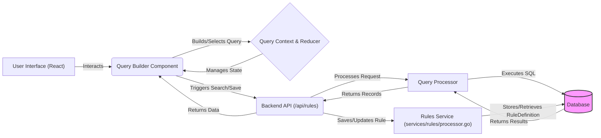

### Sequence Diagram (Typical Query Request)

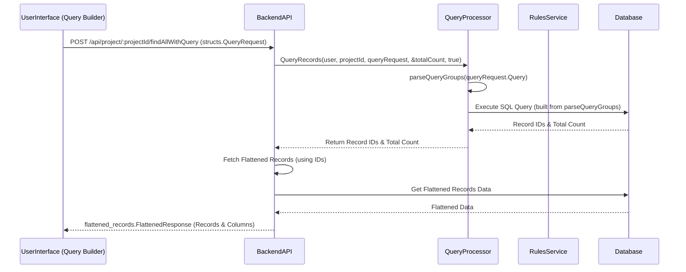

### Sequence Diagram (Saving a Query)

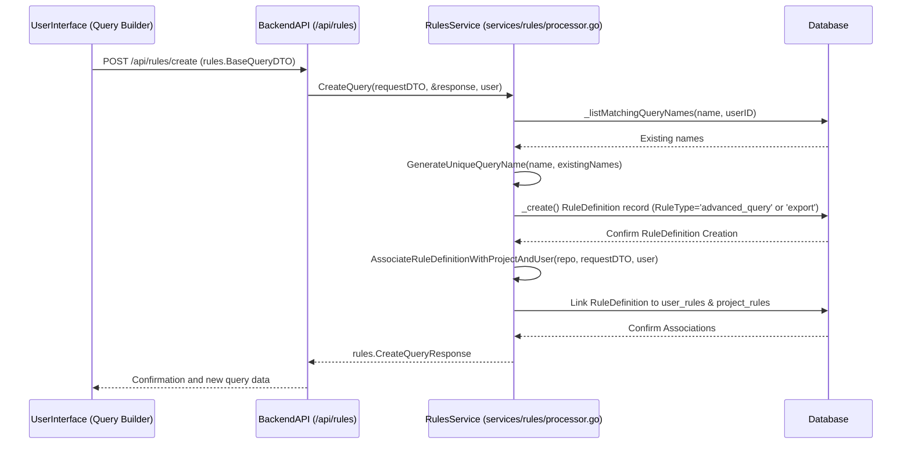

## Data Flow

### Query Building (UI)

- The user interacts with the `QueryBuilder` component within the `QueryBuilderModal`.
- Columns available for filtering are fetched via `useGetRecords` and displayed.
- The user adds conditions (field, operator, value) and groups them using `AND`/`OR` logic.
- The state of the query (filter groups) is managed by `useQueryContext` and its reducer (`queryReducer`).

### Executing Query (UI -> Backend)

- The user clicks the "Search" button in `QueryActions`.
- `handleGetFilteredRecords` is called.
- A `QueryRequest` containing the `QueryGroups`, pagination info, project ID, and included columns is assembled.
- A `POST` request is made to `/api/project/:projectId/findAllWithQuery`.

### Query Processing (Backend)

- The **projects controller** receives the request.
- It calls the `QueryProcessor.QueryRecords` method.
- `QueryProcessor` uses `parseQueryGroups` to recursively break down the `QueryGroups` JSON structure into SQL clauses and arguments.
  - `buildSQLFromGroup` and `buildSQLFromSingleCondition` handle individual conditions and groups, differentiating between `recordMetadata`, `attributeData`, and `nodeData` query types.
- Specific functions like `buildMetadataCondition`, `buildAttributesDataCondition`, `generateTagsSubQuery`, `generateJsonTextSubQuery`, and `generateGeoPointLocationSubQuery` generate SQL for different field types and operators (e.g., regex `~`, date intervals, geographic distance `ST_DWithin`).
- Helper functions like `combineClausesWithOperators` assemble the final `WHERE` clause respecting `AND`/`OR` logic.
- **Metadata conditions** query the `data_records` table (aliased as `r`) and related tables (`users` aliased as `o` and `u`, `workflow_steps` as `st`).
- **Attribute data conditions** typically involve an `EXISTS` subquery against a `filtered_attributes` view or the `data_attributes` table (aliased as `fa`), checking both `attribute_name` and the relevant value column (e.g., `fa.text`, `fa.number`, `fa.date`, `fa.json->>'key'`).
- **Node data conditions** generate an `IN` subquery checking `r.id` against `record_nodes` joined with `family_tree_nodes`.

### Database Execution & Response (Backend -> UI)

- The `QueryProcessor` executes the generated SQL query against the database using `Executor.ExecuteQuery` or `ExecuteCountQuery`.
- The database returns the IDs of matching records and the total count.
- The backend then fetches the "flattened" record data for the returned IDs using `flattened_records.Service.FindAllByRecordIds`.
- The final `FlattenedResponse` (containing record data and column definitions) is sent back to the UI.
- The UI updates the reports table with the results.

### Saving Query (UI -> Backend)

- User enters a name in `QueryInput` and clicks "Save" in `QueryActions`.
- `handleSaveQuery` is called. It checks for empty names and confirms overwrites if the name exists.
- `handleSaveOrCreate` is called to either create or update.
- For creation/update, `handleGetFilteredRecords` might be called first to get the current `matchCount`.
- A `POST` request to `/api/rules/create` (for new queries/exports) or `PUT` request to `/api/rules/update` (for existing ones) is made.
  - **Request Body (Create)**: `rules.BaseQueryDTO` with `name`, `criteria`, `projectId`, `matchCount`, `includedColumns`, and `isExport` flag. `RuleType` is set by the backend in `CreateQuery` to `"advanced_query"` or `"export"` based on `isExport`.
  - **Request Body (Update)**: `rules.UpdateQueryRequest` with `queryId`, `name`, `criteria`, `matchCount`.
- The **rules controller** (`services/rules/controller.go`) and **service** (`services/rules/processor.go`) handle the request.
  - `rules.Service.CreateQuery` uses `_repo._listMatchingQueryNames` and `GenerateUniqueQueryName` to handle potentially duplicate names.
  - `rules.Service.UpdateQuery` updates the existing `RuleDefinition` record.
- A `RuleDefinition` record is created or updated in the `rule_definitions` table.
  - `RuleType` is set to `"advanced_query"` or `"export"`.
- For new queries, `rules.Service.MakeRuleAssociations` links the rule to `user_rules` and `project_rules` join tables.
- The UI receives confirmation (`rules.CreateQueryResponse` or success message) and updates its state.

## Schema / Models

### Key Backend Models (`structs/data_models.go`, `services/rules/structs.go`)

- **`RuleDefinition`** (defined in `structs/data_models.go`, managed by `services/rules/processor.go`): Represents a saved query, saved export, monitoring rule, or duplicate detection rule.
  - `ID` (uuid.UUID): Primary key.
  - `Name` (string): User-defined name.
  - `Criteria` (base.JsonMap): The core query structure (for queries, monitoring rules) or field map (for duplicate detection).
  - `MatchCount` (int): Cached count of records matching the criteria or involved in duplicates.
  - `RuleType` (string): Differentiates types:
    - `"advanced_query"`: For saved advanced queries.
    - `"export"`: For saved export configurations (a type of advanced query).
    - `structs.RuleTypeMonitoring` (e.g., `"criteria"`): For monitoring rules.
    - `structs.RuleTypeDuplicateDetection` (e.g., `"column"`): For duplicate detection rules.
  - `IsExport` (bool): Specifically for `RuleType="advanced_query"` or `"export"`, indicates if it's an export.
  - `IncludedColumns` (base.JsonArray): List of columns for queries/exports.
  - `Threshold` (int): For monitoring rules, the violation threshold. For duplicate detection, effectively 1.
  - `Restriction` (string): e.g., "warn" for monitoring rules.
  - `Display` (bool): UI hint.
  - `WarningMessage` (string): Custom warning.
  - `RecordIDs` (base.JsonArray): For duplicate detection rules, stores IDs of duplicated records.
- **DTOs** (defined in `services/rules/structs.go`):
  - **`rules.BaseQueryDTO`**: Used for creating and listing saved queries/exports. Contains `projectId`, `name`, `criteria`, `matchCount`, `isExport`, `ruleType`, `includedColumns`.
  - **`rules.CreateQueryResponse`**: Response for creating a query/export.
  - **`rules.UpdateQueryRequest`**: Used for updating saved queries/exports. Contains `queryId`, `name`, `criteria`, `matchCount`.
  - **`rules.BaseRuleDTO`**: Generic DTO used for creating, listing, and sometimes updating monitoring rules and duplicate detection rules. Contains `projectId`, `name`, `criteria`, `restriction`, `ruleType`, `matchCount`, `threshold`, `display`, `warningMessage`, `recordIds`.
  - **`rules.CreateRuleResponse`**: Generic response for creating a monitoring rule or duplicate detection rule.
  - **`rules.UpdateRuleRequest`**: Generic DTO for updating monitoring rules or duplicate detection rules.
- **`User`**: Standard user model. Linked to `RuleDefinition` via `user_rules`.
- **`Project`**: Standard project model. Linked to `RuleDefinition` via `project_rules`.
- **`QueryGroups`, `ConditionalGroup`, `ConditionalFilter`** (defined in `models/structs/query_structs.go` or similar): Structs for query structure in `RuleDefinition.Criteria`.

### Key Frontend Models (`types/api_interfaces.ts`, `types/common_types.ts`)

- **`RuleDefinition`** (`api_interfaces.ts`): Frontend representation mirroring the backend `RuleDefinition` DB model. Used for saved queries, exports, monitoring rules, and duplicate detection rules.
- **`QueryGroups`, `ConditionalGroup`, `ConditionalFilter`** (`common_types.ts`): Core TypeScript types for defining the hierarchical query structure used in `RuleDefinition.criteria`.
- **`QueryOptions`, `FilterableFieldTypes`, `LogicalOperators`, `ConditionalOperators`** (`common_types.ts`): Enums defining the available options for building filter conditions.
- **`QueryRequest`** (`api_interfaces.ts`): Payload for executing an advanced query or fetching data for an export, containing `QueryGroups`, pagination, columns, etc.
- **`CreateQueryRequest`, `CreateQueryResponse`, `UpdateQueryRequest`** (`api_interfaces.ts`): DTOs for creating and updating saved queries and exports specifically.
- **`QueryState`** (`common_types.ts`): Interface representing the frontend state for advanced search, including `queryGroups` and a potentially `selectedExport` (which is a `RuleDefinition`).
- **`DataTableColumn`, `OrderedColumn`** (`api_interfaces.ts`): Interfaces for column definitions used in displaying query results and configuring exports.

### Entity-Relationship Diagram (Simplified)

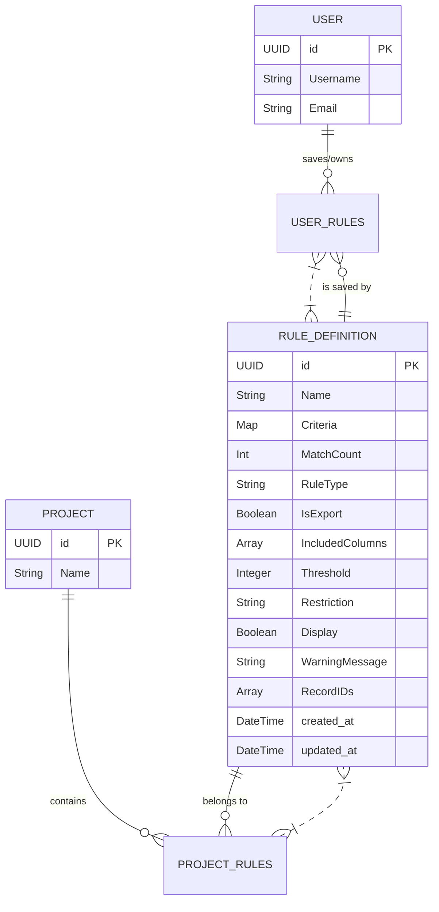

## API Endpoints / SQL Snippets

### API Endpoints (`routes/routes.go`, `services/rules/controller.go`)

- **`POST /api/project/:projectId/findAllWithQuery`**: Executes an advanced query.
  - Controller: `projects.Controller.FindAllRecordsWithQuery`
  - Request Body: `structs.QueryRequest`
  - Response Body: `flattened_records.FlattenedResponse`
- **`GET /api/rules/listQueriesAndExports/:projectId`**: Lists saved advanced queries and exports for a user in a project.
  - Controller: `rules.Controller.ListAllQueriesAndExportsByUserAndProject`
  - URL Param `isExport=true` can be used to filter for exports.
  - Response Body: `[]rules.BaseQueryDTO`
- **`POST /api/rules/create`**: Creates a new saved query or export.
  - Controller: `rules.Controller.CreateQuery`
  - Request Body: `rules.BaseQueryDTO` (`RuleType` determined by backend based on `IsExport`)
  - Response Body: `rules.CreateQueryResponse`
- **`PUT /api/rules/update`**: Updates an existing saved query or export.
  - Controller: `rules.Controller.UpdateQuery`
  - Request Body: `rules.UpdateQueryRequest`
  - Response Body: Success message or error.
- **`GET /api/rules/listRulesByProject/:projectId`**: Lists all rules (queries, exports, monitoring rules, duplicate detection) for a given project.
  - Controller: `rules.Controller.ListRulesByProject`
  - Response Body: `[]rules.BaseRuleDTO`
- **`GET /api/rules/getRule/:ruleId`**: Retrieves a specific rule by its ID.
  - Controller: `rules.Controller.GetRule`
  - Response Body: `rules.RuleDefinition` (the full DB model)
- **`POST /api/rules/createRule`**: Creates a new monitoring rule or duplicate detection rule.
  - Controller: `rules.Controller.CreateRule`
  - Request Body: `rules.BaseRuleDTO` (with `RuleType` specifying "criteria" or "column")
  - Response Body: `rules.CreateRuleResponse`
- **`PUT /api/rules/updateRule`**: Updates an existing monitoring rule or duplicate detection rule.
  - Controller: `rules.Controller.UpdateRule`
  - Request Body: `rules.UpdateRuleRequest`
  - Response Body: Success message or error.
- **`DELETE /api/rules/deleteRule/:ruleId`**: Deletes any type of rule (query, export, monitoring rule, duplicate detection).
  - Controller: `rules.Controller.DeleteRule`
  - Response Body: Success message or error.

---

## Threshold Monitoring Workflow (Saved Query Rules - Monitoring Rules)

### Overview

The Threshold Monitoring Workflow feature enables users to define rules ("Monitoring Rules") that monitor record data against query-defined thresholds. When a record is created or updated, the system evaluates these monitoring rules. If a monitoring rule's criteria are met by the record and its total matching record count reaches or exceeds a specified threshold, a warning is presented to the user.

**Purpose**: To proactively inform users about data record volumes or patterns that meet certain predefined, query-based conditions and thresholds.

### Architecture Diagram

#### System Context Diagram

```mermaid
graph LR
    AdminUI["Admin UI (Project Builder - Monitoring Page)"] -- Configures Rule --> BackendAPI["Backend API (/api/rules)"];
    UserUI["User UI (Record Form)"] -- Creates/Updates Record --> BackendAPI_Rec["Backend API (/api/record)"];

    BackendAPI -- Create/Update Monitoring Rule --> RuleSvc["Rules Service (services/rules/processor.go)"];
    BackendAPI_Rec -- Create/Update Record --> RecordSvc["Record Service (services/records/processor.go)"];

    RuleSvc -- Stores/Retrieves Monitoring Rule (RuleDefinition Table) --> Database[(Database)];
    RuleSvc -- Uses --> QueryProcessor["Query Processor"];

    RecordSvc -- Triggers Check --> RuleSvc;
    QueryProcessor -- Executes Monitoring Query --> Database;

    Database -- Returns Query Results/Counts --> QueryProcessor;
    QueryProcessor -- Returns Counts --> RuleSvc;
    RuleSvc -- Returns Violated Rules --> RecordSvc;
    RecordSvc -- Includes Violations in Response --> BackendAPI_Rec;
    BackendAPI_Rec -- Sends Violation Info --> UserUI;
    UserUI -- Displays --> MonitoringWarningDialog["Monitoring Warning Dialog"];

    style Database fill:#f9f,stroke:#333,stroke-width:2px;
```

#### Sequence Diagram (Configuring a Monitoring Rule)

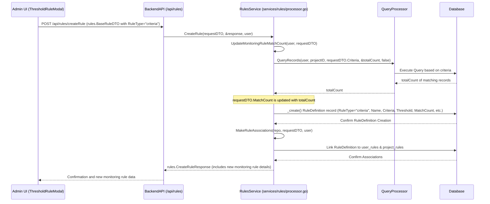

#### Sequence Diagram (Record Triggering Monitoring Check)

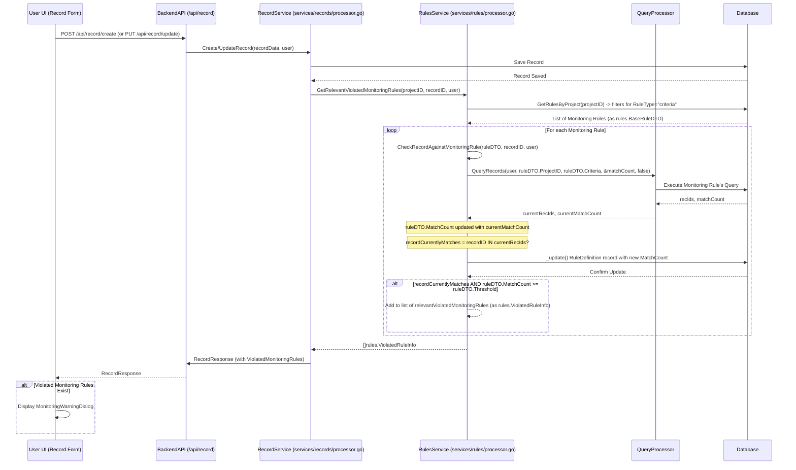

### Data Flow

---

#### Configuration (Admin UI → Backend)

- **UI Interaction**: Admin uses `ThresholdRulesTable.tsx` and `ThresholdRuleModal.tsx` in Project Builder.
- **Define Monitoring Rule**: Admin provides a name, defines query criteria using the QueryBuilder, and sets a numeric threshold.
- **Save Action**: Clicking "Save" in `ThresholdRuleModal.tsx` triggers `handleSaveOrUpdate`.

##### API Request

- **New Monitoring Rule**: `createRule` mutation → `POST /api/rules/createRule`
  Payload: `rules.BaseRuleDTO` (`projectId`, `name`, `criteria`, `threshold`, `ruleType="criteria"` (or `structs.RuleTypeMonitoring`), `restriction="warn"`)
- **Update Monitoring Rule**: `updateRule` mutation → `PUT /api/rules/updateRule`
  Payload: `rules.UpdateRuleRequest` (includes `ruleId`, `ruleType="criteria"`, and other fields to update)

##### Backend Processing (`services/rules/processor.go`)

- `RulesService.CreateRule` or `RulesService.UpdateRule` is invoked.
- For creation/update of a monitoring rule:
  - `RulesService.UpdateMonitoringRuleMatchCount` is called to run the monitoring rule's query (`QueryProcessor.QueryRecords`) and get the initial/updated `matchCount`. The `BaseRuleDTO`'s `MatchCount` field is updated.
- A `RuleDefinition` record is created/updated in the DB (`RuleType` is `"criteria"` or `structs.RuleTypeMonitoring`).
- `RulesService.MakeRuleAssociations` links it to `user_rules` and `project_rules` for new monitoring rules.

---

#### Record Lifecycle Triggers & User Feedback (User Action → Backend)

When a user performs actions such as creating, updating, deleting, duplicating, advancing the workflow step, or changing the access of a record, the backend services (`services/records/processor.go`) interact with the monitoring and duplicate detection systems. The user generally receives immediate feedback on violated monitoring rules and duplicate detection rules that are relevant to the specific record they interacted with.

- **User Actions**:

  - Create Record (`POST /api/record/create/...`)
  - Update Record (`PUT /api/record/update`)
  - Delete Record (`DELETE /api/record/delete/...`)
  - Advance Workflow Step (`PUT /api/record/advance/...`)
  - Duplicate Record (`POST /api/record/duplicate/...`)
  - Change Record Access (`PUT /api/record/access/...`)

- **Backend Processing (`services/records/processor.go`)**:

  - **For `Create`, `UpdateRecord`, `AdvanceWorkflowStep`, `DuplicateRecord`, `ChangeRecordAccess` (Monitoring Rules)**:

    - After the primary operation, the service calls `CheckMonitoringRulesForRecord(projectID, recordID, user)`.
    - This function, through `rules.Service.GetRelevantViolatedMonitoringRules`, identifies "criteria" type monitoring rules violated by the _current state of that specific record_.
    - Details of these `ViolatedMonitoringRules` are included in the API response, informing the user immediately about monitoring issues relevant to their action on that record.
    - Overall monitoring rule counts (e.g., on dashboards) reflect these changes upon their next refresh/update.

  - **For `DeleteRecord` (Monitoring Rules)**:
    - The service calls `checkMonitoringRulesTriggeredByRecordAction(recordRepo, user)`.
    - This function triggers `rules.UpdateAllMonitoringRuleMatchCountsForProject(projectID, user)`, recalculating monitoring rule results across the _entire project_. This ensures overall monitoring rule counts are accurate post-deletion.
    - It also calls `rules.CheckMonitoringRulesWithinProject(projectID)` to identify triggered monitoring rules (excluding "column" type in this path).
    - The direct API response for `DeleteRecord` _does not_ include a list of violated monitoring rules related to the deletion or the broader update. Users would see these updates reflected in general views of monitoring rule statuses/counts, but they will not be warned of any violations.

---

#### Monitoring Check Details (Backend)

##### `CheckMonitoringRulesForRecord` (`services/records/processor.go`)

- Delegates to `rules.Service.GetRelevantViolatedMonitoringRules(projectID, recordID, user)`. This function focuses on identifying monitoring rules that the _specified record_ violates.

##### `GetRelevantViolatedMonitoringRules` (`services/rules/processor.go`)

- Fetches all `RuleDefinition` records for the given project using `RulesService.GetRulesByProject`.
- Filters these rules to only include those where `RuleType == structs.RuleTypeMonitoring` (e.g., "criteria").
- For each of these "criteria" monitoring rules (as `rules.BaseRuleDTO`):
  - Calls `RulesService.CheckRecordAgainstMonitoringRule(currentRuleDTO, recordID, user)` to determine if the given record violates the monitoring rule's criteria and to update the monitoring rule's `MatchCount`.
- The `RuleDefinition` record in the DB is updated with the new `MatchCount` via `_repo._update()`.
- If the record matches the criteria AND the monitoring rule's `MatchCount >= Threshold`, it's added to a list.
- The output is a list of `rules.ViolatedRuleInfo` structs, detailing only the monitoring rules that the specific record has violated.

##### `CheckRecordAgainstMonitoringRule` (`services/rules/processor.go`)

- Converts `Criteria (base.JsonMap)` from the `rules.BaseRuleDTO` to `QueryGroups`.
- Calls `QueryProcessor.QueryRecords` to get:
  - `recIds`: record IDs matching the criteria.
  - `matchCount`: number of matching records.
- Checks if the current `recordID` is in `recIds` → `currentlyMatches`.
- Updates the passed-in `ruleDTO.MatchCount` in memory with `matchCount`.
- Returns `currentlyMatches`.

##### Back in `GetRelevantViolatedMonitoringRules`

- After `CheckRecordAgainstMonitoringRule`, the DB record for `currentRule` is updated with the new `MatchCount` using `ras._repo._update()`.
- If `currentlyMatches == true` **and** `monitoringRule.MatchCount >= monitoringRule.Threshold` → monitoring rule is considered "violated" by the current record and is added to a temporary list of `rules.BaseRuleDTO`.
- This list is then converted into `[]rules.ViolatedRuleInfo` (containing `RuleID`, `RuleName`).

##### Warning Display (Backend → UI)

##### Service Response (`services/records/processor.go`)

- `[]rules.ViolatedRuleInfo` is included in the `RecordResponse` DTO (e.g., `response.ViolatedMonitoringRules`).

##### UI Handling (`MonitoringWarning.tsx`)

- If `violatedMonitoringRules.length > 0`, the `MonitoringWarning` dialog is rendered.
- Displays the names of violated monitoring rules (`a.ruleName`)
- User can select a monitoring rule
- Clicking `VIEW RULE` sets `ruleId` using `useRuleParams` to filter/report on the violating monitoring rule

---

### Schema / Models

---

#### Key Backend Models (`structs/data_models.go`)

**RuleDefinition**

- `ID` (`uuid.UUID`): Primary key
- `Name` (`string`): Monitoring rule name (user-defined)
- `Criteria` (`base.JsonMap`): Query definition (QueryGroups structure)
- `Threshold` (`int`): Match count threshold
- `MatchCount` (`int`): Count of records that currently match
- `Restriction` (`string`): Violation action; fixed as `"warn"`
- `RuleType` (`string`): Fixed as `"criteria"`
- `Display` (`bool`): Whether to show in UI (default `true`)
- `WarningMessage` (`string`): Custom message to display
- `IncludedColumns` (`base.JsonArray`): Columns shown when reviewing violations
- `User`: Linked via `user_rules`
- `Project`: Linked via `project_rules`
- `DataRecords`: Records evaluated against the monitoring rule criteria

---

#### Key Frontend Models (`types/api_interfaces.ts`, `types/common_types.ts`)

- **`RuleDefinition`** (`api_interfaces.ts`): Frontend representation of a saved monitoring rule (where `ruleType` would be `"criteria"` or `structs.RuleTypeMonitoring`).
- **`CreateRuleRequest`, `CreateRuleResponse`, `UpdateRuleRequest`** (`api_interfaces.ts`): DTOs used for creating and updating monitoring rules (as well as duplicate detection rules) via the generic rule endpoints.
- **`ViolatedRuleInfo`** (`api_interfaces.ts`): DTO included in record responses to detail which monitoring rules are violated (`ruleId`, `ruleName`).
- **`QueryGroups`, `ConditionalGroup`, `ConditionalFilter`** (`common_types.ts`): Core types for defining the monitoring rule's query criteria.
- **`RuleType`, `RuleRestriction`** (`common_types.ts`): Enums relevant to defining the properties of a monitoring rule.

### Entity-Relationship Diagram (Monitoring Context)

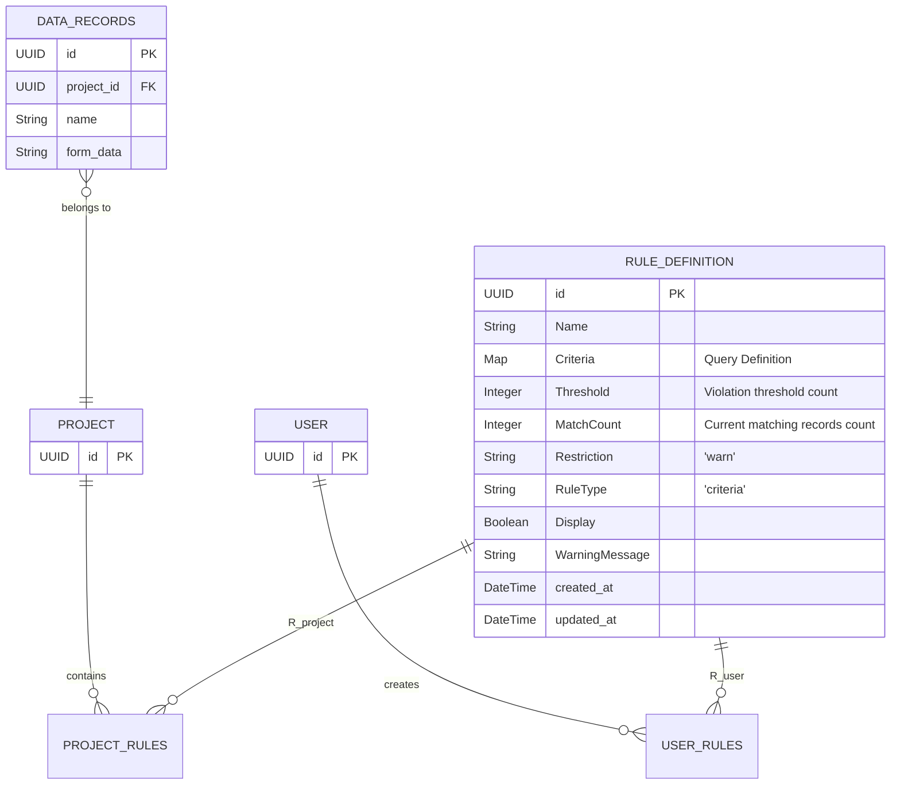

### API Endpoints / SQL Snippets

---

#### API Endpoints (`routes/routes.go`)

- **POST `/api/rules/createRule`**  
  Creates a new monitoring rule.

  - **Request Body**: `rules.BaseRuleDTO` (superset of `RuleDefinition` fields)
  - **Response Body**: `rules.CreateRuleResponse`

- **PUT `/api/rules/updateRule`**  
  Updates an existing monitoring rule.

  - **Request Body**: `rules.UpdateRuleRequest`
  - **Response Body**: Success message

- **GET `/api/rules/listRulesByProject/:projectId`**  
  Lists all rules (and other rule types) for a given project.

  - **Response Body**: `[]rules.BaseRuleDTO`

- **GET `/api/rules/getRule/:ruleId`**  
  Retrieves a specific monitoring rule by its ID.

  - **Response Body**: `rules.RuleDefinition`

- **DELETE `/api/rules/deleteRule/:ruleId`**  
  Deletes a monitoring rule.

> 🔁 **Note**:  
> The record endpoints `POST /api/record/create/...` and `PUT /api/record/update` **internally trigger the monitoring rule checks** after a record is created or updated.

---

#### SQL Snippets

SQL snippets related to monitoring rules are **embedded within backend services** (`rules/processor.go`, `repository.go`) and are **not directly exposed as standalone API endpoints**. They include:

- Insertions into `rule_definitions`
- Updates to `match_count`
- Join table associations (`user_rules`, `project_rules`)

---

### Configuration Parameters

| Parameter          | Type                           | Description                                                                                                                                                 |
| ------------------ | ------------------------------ | ----------------------------------------------------------------------------------------------------------------------------------------------------------- |
| **Name**           | `string`                       | User-defined name for the monitoring rule.                                                                                                                  |
| **Criteria**       | `base.JsonMap` / `QueryGroups` | Advanced search query conditions; defined via QueryBuilder.                                                                                                 |
| **Threshold**      | `int`                          | The value that, if met or exceeded by `MatchCount`, triggers the monitoring rule. Set in `ThresholdRuleModal.tsx` (min: 1).                                 |
| **Restriction**    | `string`                       | Hardcoded to `"warn"` when creating. Currently defines the action on violation.                                                                             |
| **RuleType**       | `string`                       | Hardcoded to `"criteria"` to identify monitoring-based rules.                                                                                               |
| **Display**        | `bool`                         | Hardcoded to `true`. Determines if the monitoring rule is visible in certain UI listings.                                                                   |
| **WarningMessage** | `string`                       | Backend default: `"{Rule Name}: Placeholder warning message"`. The current UI does not expose a text field for custom messages in `ThresholdRuleModal.tsx`. |

## Duplicate Detection Rules (Saved Query Rules - Duplicate Detection Rules)

#### Overview

The Duplicate Detection Rules feature helps maintain data integrity by identifying potential duplicate record attributes within a project. Administrators define rules by selecting a set of attributes. If multiple records have the exact same combination of values for all selected attributes in a rule, they are considered potential duplicates. The system then flags these, updates a count on the rule, and can warn the user if a new or updated record creates or contributes to a duplicate set.

- **Purpose**: To alert users to and help manage potentially redundant or identical records based on key attribute value combinations.

---

### Architecture Diagram

#### System Context Diagram

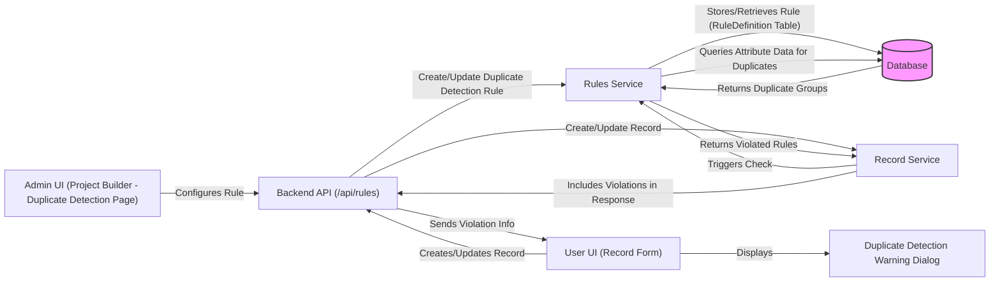

### Sequence Diagram – Configuring a Duplicate Detection Rule

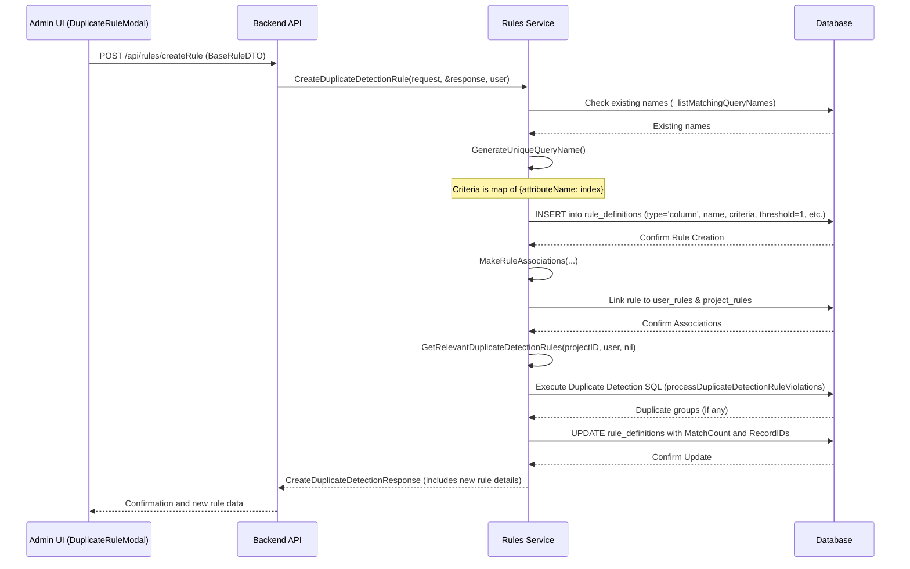

### Sequence Diagram - Record Triggering Duplicate Detection Check

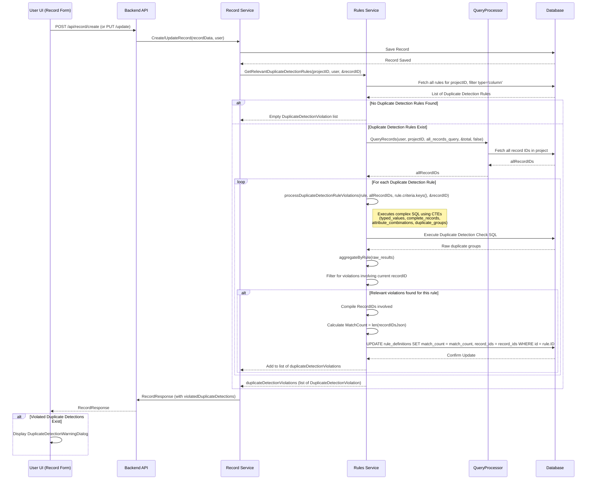

### Data Flow – Duplicate Detection Rules

#### Configuration (Admin UI -> Backend)

- **UI Interaction**: Admin uses `DuplicateDetectionTable.tsx` and `DuplicateRuleModal.tsx` in Project Builder.
- **Define Rule**: Admin provides a name and selects one or more attributes from the available form component attributes (derived from `columns` prop, initially from `useGetRecords`).
- **Criteria Generation**: The selected attributes' `searchNames` are transformed into a JSON map like `{"attribute1_searchName": 0, "attribute2_searchName": 1, ...}` which is stored in the `criteria` property of the rule.
- **Save Action**: Clicking **Save** in `DuplicateRuleModal.tsx` triggers `handleSaveOrUpdate`.

**API Request**:

- **New rules**: `createDuplicateDetectionRule` mutation → `POST /api/rules/createRule`. Request payload: `BaseRuleDTO` adapted for duplicate detection.
- **Updates**: `updateDuplicateDetectionRule` mutation → `PUT /api/rules/updateRule`. Request payload: `UpdateDuplicateDetectionRequest`.

**Backend Processing (`rules/processor.go`)**:

- `CreateDuplicateDetectionRule` or `UpdateDuplicateDetectionRule` is invoked.
- A `RuleDefinition` record is created/updated:
  - `RuleType` is set to `"column"`.
  - `Threshold` is fixed to `1`.
  - `criteria` stores the map of selected attribute names.
- The rule is associated with `user` and `project`.
- After creation/update, `GetRelevantDuplicateDetectionRules` is called with `recordID = nil` to perform an initial scan for duplicates based on this rule and populate `MatchCount` and `RecordIDs`.

---

#### Record Trigger (User Action -> Backend)

- **User Action**: A user creates or updates a record.
- **API Call**: Frontend makes a request to `POST /api/record/create/...` or `PUT /api/record/update`.

**Backend Service (`records/processor.go`)**:

- `Create` or `UpdateRecord` processes the record.
- After saving, it calls `rules.Service.GetRelevantDuplicateDetectionRules(projectID, user, &recordID)`.

- **For `UpdateRecord` and `DuplicateRecord` (Duplicate Detection Rules)**:

- In addition to monitoring rule checks, these operations call `rules.Service.GetRelevantDuplicateDetectionRules(projectID, user, &recordID`.
- This checks the _current record_ against active duplicate detection rules.
- Any `ViolatedDuplicateDetections` are also included in the API response for immediate user feedback.

- **For `CreateRecord` and `DeleteRecord` (Duplicate Detection Rules)**:

- `rules.Service.GetRelevantDuplicateDetectionRules(projectID, user, nil)` is called. The `nil` record ID indicates a general check for duplicate detection rules (e.g., for the project or user context) rather than a check against the specific record being created or deleted.
- The results of this general check are _not_ directly included in the API response for these actions.

---

### Duplicate Detection Check (Backend)

The primary function responsible for evaluating records against duplicate detection rules is `GetRelevantDuplicateDetectionRules` located in `rules/processor.go`. This function is called by `records/processor.go` during various record lifecycle events.

**Invocation from `records/processor.go`**:

- **During `UpdateRecord` and `DuplicateRecord`**:

  - `records/processor.go` calls `rules.Service.GetRelevantDuplicateDetectionRules(projectID, user, &recordID)`, providing the ID of the record being updated or created (as a duplicate).
  - The `ViolatedDuplicateDetections` returned by `GetRelevantDuplicateDetectionRules` are specific to this record and are included in the API response, providing immediate feedback to the user.

- **During `CreateRecord` and `DeleteRecord`**:
  - `records/processor.go` calls `rules.Service.GetRelevantDuplicateDetectionRules(projectID, user, nil)`, passing `nil` for the record ID.
  - In this case, `GetRelevantDuplicateDetectionRules` still processes all "column" type rule definitions in the project. It updates the `RuleDefinition` database records for any rules that have new or changed violation counts based on the current state of all records in the project.
  - However, the API response for the `CreateRecord` or `DeleteRecord` action itself _does not_ include a `ViolatedDuplicateDetections` list. The user would become aware of any new or resolved duplicate detections by viewing the list of duplicate detection rules or other UI elements that display violation counts for the project. `CreateRecord` is relevant only for record metadata attributes such as `created_at`, which is not associated with duplicate detection rules, which apply only to form attributes.

**`GetRelevantDuplicateDetectionRules` (`rules/processor.go`) internal logic**:

- Fetches all rule records for the given `projectID` and filters for those where `RuleType == "column"` (these are the duplicate detection rules).
- If no such rules exist, it returns an empty list of violations.
- Otherwise, it proceeds to fetch all record IDs within the project using `QueryProcessor.QueryRecords` to have a complete set of records for comparison.

For **each duplicate detection rule** (i.e., each "column" type rule):

- It extracts the attribute keys (the columns to check for duplicates) from `rule.Criteria`.
- It then calls `processDuplicateDetectionRuleViolations(rule, allRecordIDsInProject, attributeKeys, recordID_ptr)`. The `recordID_ptr` is the specific record ID passed from `records/processor.go` (for Update/Duplicate) or `nil` (for Create/Delete).

**`processDuplicateDetectionRuleViolations` (`rules/processor.go`) internal logic**:

- This function executes a complex SQL query using Common Table Expressions (CTEs) to identify duplicate entries based on the rule's criteria:
  - **`typed_values`**: Fetches the values for the attributes specified in the rule's `Criteria` from the `data_attributes` table, casting them to their appropriate data types.
  - **`complete_records`**: Filters out records that do not have values for _all_ the attributes defined in the current duplicate detection rule.
  - **`attribute_combinations`**: For each record, it creates a "duplicate signature" by concatenating the string representations of its values for the rule's attributes, sorted to ensure order doesn't affect the signature (e.g., "valueA,valueB").
  - **`duplicate_groups`**: Groups records by this "duplicate signature". Any group with a `COUNT(*) > 1` indicates a set of duplicate records according to the rule.

**Result Processing within `GetRelevantDuplicateDetectionRules` after `processDuplicateDetectionRuleViolations`**:

- The violations are aggregated by the rule (`aggregateByRule`).
- **If a specific `recordID` was provided** (from an Update or Duplicate operation):
  - The results are filtered to include only those violation groups that contain this specific `recordID`. This ensures the user is only alerted to duplicate detections relevant to the record they are interacting with.
- If relevant violations are found (either for a specific record or for the project in general):
  - A JSON array of all `recordIDs` involved in each violation (`recordIDsJson`) is compiled.
  - The total count of records involved in the violations for that rule (`MatchCount`) is calculated.
  - The corresponding `RuleDefinition` record for the rule in the database is updated with these latest `recordIDsJson` and `MatchCount`.
- Finally, `GetRelevantDuplicateDetectionRules` returns a list of `structs.DuplicateDetectionViolation`. This list will be empty if no violations are found, or if a `recordID` was provided but it's not part of any duplicate detection.

---

### Warning Display (Backend -> UI)

**Service Response (`records/processor.go`)**:

- The `DuplicateDetectionViolation` list is included in `RecordResponse.ViolatedDuplicateDetections`.

**UI Handling (`DuplicateDetectionWarning.tsx`)**:

- If `violatedDuplicateDetections` is non-empty, shows the warning dialog.
- Displays names of violated rules (`a.ruleName`).
- User selects a rule and clicks **VIEW RULE**.

**On Click**:

- Finds `recordIds` associated with the selected rule.
- Calls `getRecordsByIds` (React Query mutation) to fetch those duplicates.
- Calls `setRuleId(duplicateDetectionId)` to potentially filter the reports table using the rule's ID.

---

### Schema / Models

#### Key Backend Models (`structs/data_models.go`, `services/rules/structs.go`)

- **RuleDefinition** (duplicate detection rule record):
  - `RuleType` will be `structs.RuleTypeDuplicateDetection` (e.g., `"column"`).
  - `Criteria` = map like `{"attributeName1": 0, "attributeName2": 1}`.
  - `Threshold`: Always `1` → at least 2 records match.
  - `MatchCount`: Count of records in duplicate groups.
  - `RecordIDs`: JSON array of UUIDs involved in duplicates (updated dynamically).
  - `Restriction` (`string`): e.g., `"warn"`.
- **DataAttributes**: Stores record attribute values (Text, Number, Date, etc.).
- **RecordAttributes**: Join table linking `DataRecords` to `DataAttributes`.
- **DuplicateDetectionViolation** (`rules/structs.go`):
  - `RuleID` (uuid.UUID): Rule ID.
  - `RuleName` (string): Rule name.
  - `RecordIDs` ([]string): Records forming the group.
  - `DuplicateCount` (int): Size of duplicate group.
  - `Attributes` (base.JsonMap): Example matched attribute values.

#### Key Frontend Models (`types/api_interfaces.ts`, `types/common_types.ts`)

- **`RuleDefinition`** (`api_interfaces.ts`): Frontend representation of a duplicate detection rule (where `ruleType` would be `"column"` or `structs.RuleTypeDuplicateDetection`). `criteria` in this context is a `Record<string, number>` mapping attribute search names to an index.
- **`DuplicateDetectionRule`** (`api_interfaces.ts`): Appears to be a more specific type or alias for `RuleDefinition` when `ruleType` is `"column"`. It shares the same fundamental structure.
- **`CreateRuleRequest`, `CreateRuleResponse`, `UpdateRuleRequest`** (`api_interfaces.ts`): DTOs used for creating and updating duplicate detection rules via the generic rule endpoints.
- **`DuplicateDetectionViolation`** (`api_interfaces.ts`): DTO that mirrors the backend struct, detailing a specific group of duplicate records. Contains `ruleId`, `ruleName`, `recordIds` (for the group), `duplicateCount`, and example `attributes` values.
- **`DuplicateAttribute`** (`api_interfaces.ts`): Represents an attribute and its value within a `DuplicateDetectionViolation`.
- **`RuleType`** (`common_types.ts`): Enum that includes `"column"` for duplicate detection rules.
- **`DataTableColumn`** (`api_interfaces.ts`): Used in `DuplicateRuleModal.tsx` to list selectable attributes for rule configuration, providing `header` and `searchName`.

### API Endpoints / SQL Snippets

#### API Endpoints (`routes/routes.go`, `services/rules/controller.go`)

- **`POST /api/rules/createRule`**: Creates a new duplicate detection rule.

  - Controller: `rules.Controller.CreateRule`
  - Request Body: `rules.BaseRuleDTO` (with `RuleType=structs.RuleTypeDuplicateDetection` and `criteria` as attribute map).
  - Response Body: `rules.CreateRuleResponse`.

- **`PUT /api/rules/updateRule`**: Updates an existing duplicate detection rule.

  - Controller: `rules.Controller.UpdateRule`
  - Request Body: `rules.UpdateRuleRequest` (with `RuleType=structs.RuleTypeDuplicateDetection`).
  - Response Body: Success message.

- **`GET /api/rules/listRulesByProject/:projectId`**: Lists all rules for a project, including duplicate detection rules.

  - Controller: `rules.Controller.ListRulesByProject`
  - Response Body: `[]rules.BaseRuleDTO`.

- **`GET /api/rules/getRule/:ruleId`**: Retrieves a specific duplicate detection rule by its ID.

  - Controller: `rules.Controller.GetRule`
  - Response Body: `rules.RuleDefinition`.

- **`DELETE /api/rules/deleteRule/:ruleId`**: Deletes a duplicate detection rule.

  - Controller: `rules.Controller.DeleteRule`
  - Response Body: Success message.

- **Record Endpoints**:
  Record `create/update/duplicate` endpoints (e.g., `POST /api/record/create/...`, `PUT /api/record/update`) in `services/records/controller.go` internally trigger the duplicate detection rule checks via `rules.Service.GetRelevantDuplicateDetectionRules`.

---

#### SQL Snippets (`services/rules/processor.go`)

**Core Duplicate Detection Check Query (`processDuplicateDetectionRuleViolations` in `services/rules/processor.go`)**:

```sql
-- This is a complex query using CTEs, a conceptual representation:
WITH typed_values AS (
    -- 1. Selects values for the attributes specified in the rule from the 'data_attributes' table,
    --    joining with 'record_attributes' to link to records.
    -- 2. Casts values to appropriate types or a common comparable format (often text).
    SELECT
        ra.data_records_id::text,
        a.attribute_name,
        a.attribute_type,
        -- CASE ... a.text, a.number, a.date, a.boolean ... END AS value
        -- Also select native types for precise comparison where needed
        a.boolean AS boolean_value, a.number AS number_value, a.date AS date_value
    FROM data_attributes a JOIN record_attributes ra ON ra.data_attributes_id = a.id
    WHERE a.attribute_name = ANY($1::text[]) -- $1: array of attribute_search_names from rule.Criteria
      AND ra.data_records_id = ANY($2::uuid[]) -- $2: array of all record IDs in the project
),
complete_records AS (
    -- 3. Filters for records that have non-null values for ALL attributes in the rule.
    SELECT data_records_id
    FROM typed_values
    WHERE
        -- Ensure value is NOT NULL for each attribute type involved in the rule
        ( (attribute_type = 'boolean' AND boolean_value IS NOT NULL) OR
          (attribute_type = 'number' AND number_value IS NOT NULL) OR
          (attribute_type = 'date' AND date_value IS NOT NULL) OR
          (attribute_type = 'text' AND value IS NOT NULL AND value != '')
          -- ... add other types like json, geo_point if they need specific non-null checks
        )
    GROUP BY data_records_id
    HAVING COUNT(DISTINCT attribute_name) = $3 -- $3: number of attributes in the rule
),
attribute_combinations AS (
    -- 4. For each 'complete' record, creates a signature string by concatenating
    --    its values for the rule's attributes, sorted by attribute_name for consistency.
    SELECT
        cr.data_records_id,
        string_agg(COALESCE(tv.value::text, '_NULL_'), ',' ORDER BY tv.attribute_name) AS exact_values
    FROM complete_records cr
    JOIN typed_values tv ON cr.data_records_id = tv.data_records_id::uuid
    GROUP BY cr.data_records_id
),
duplicate_groups AS (
    -- 5. Groups records by this 'exact_values' signature.
    -- 6. Finds groups with more than one record (i.e., duplicates).
    SELECT
        array_agg(data_records_id) as record_ids_text_array, -- Keep as text for now
        exact_values,
        COUNT(*) as duplicate_count
    FROM attribute_combinations
    GROUP BY exact_values
    HAVING COUNT(*) > 1
)
-- 7. Formats the output for each duplicate group.
SELECT
    dg.duplicate_count,
    dg.record_ids_text_array, -- Array of record ID strings
    $4::uuid as rule_id, -- $4: rule.ID
    $5::text as rule_name, -- $5: rule.Name
    -- Extract example attribute values for one of the duplicates (e.g., first in array)
    (SELECT json_agg(json_build_object('attributeName', tv_ex.attribute_name, 'value', tv_ex.value) ORDER BY tv_ex.attribute_name)
     FROM typed_values tv_ex
     WHERE tv_ex.data_records_id = (dg.record_ids_text_array[1])::uuid -- Example from first ID
       AND tv_ex.value IS NOT NULL AND tv_ex.value != ''
    )::jsonb as attributes
FROM duplicate_groups dg;
```

Note: `$1`, `$2`, `$3`, `$4`, `$5` are placeholders for prepared statement arguments

- `pq.Array(keys)`
- `pq.Array(allRecordIDs)`
- `len(keys)`
- `rule.ID`
- `rule.Name`
  - `"rule"` refers to current Duplicate Detection Rule (`rules.BaseRuleDTO`).

### Configuration Parameters

- **Name** (`string`): User-defined name for the duplicate detection rule. Part of `rules.BaseRuleDTO`.
- **Criteria** (`base.JsonMap`): A map where keys are the `searchName` (or `AttributeName`) of the attributes to be checked for duplicates, and values are incidental (e.g., `{"attribute_name1": 0, "attribute_name2": 1}`). Configured via `DuplicateRuleModal.tsx`. Part of `rules.BaseRuleDTO`.
- **Attributes** (`Selection`): Specific form attributes chosen by the admin to determine what constitutes a "duplicate." This translates into the `Criteria` map.
- **RuleType** (`string`): Always `structs.RuleTypeDuplicateDetection` (e.g. `"column"`) to identify it as a duplicate detection rule. Part of `rules.BaseRuleDTO`.
- **Threshold** (`int`): Fixed to `1` internally for duplicate detection rules (meaning `MatchCount` reflecting number of items in duplicate sets, and SQL logic uses `HAVING COUNT(*) > 1` for groups). Part of `rules.BaseRuleDTO`.
- **ProjectID** (`uuid.UUID`): The ID of the project this rule belongs to. Part of `rules.BaseRuleDTO`.
- **MatchCount** (`int`): (In DTO for update) Stores the count of records part of any duplicate group for this rule.
- **RecordIDs** (`base.JsonArray`): (In DTO for update, not typically set by client) Stores record IDs involved in duplicate detections.
