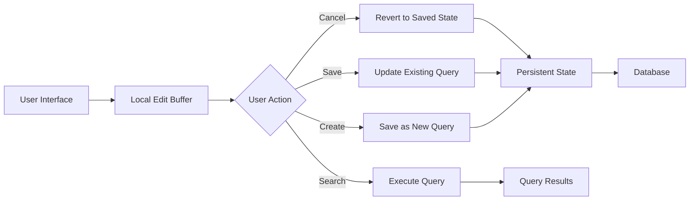

# Managing Complex User State: A React Pattern for Editable Saved Queries with Reversion

_How to elegantly handle local editing states while maintaining data integrity and providing seamless user experience in complex search interfaces_

---

## The Challenge: When Users Need to "Try Before They Commit"

Picture this scenario: Your users have spent time crafting complex database queries with multiple filters, operators, and conditions. They've saved these queries for reuse, but now they want to experiment with modifications—adding new filters, tweaking date ranges, or adjusting search criteria—without losing their original saved work.

This is where most applications fail. Either they:

1. **Auto-save everything**, making it impossible to experiment safely
2. **Require explicit save actions**, but provide no way to revert changes
3. **Mix local and persistent state**, creating confusing UX where users can't tell what's saved vs. what's temporary

Today, I'll walk you through a robust **State Tracking Pattern** that solves this elegantly by separating local editing state from persistent data, while providing clear reversion capabilities.

## The Pattern: Local Edit Buffer with Persistent State Synchronization

The core principle is simple but powerful: **maintain two distinct state layers**:

- **Local Edit Buffer**: React component state that holds the user's current modifications
- **Persistent State**: Database-backed saved queries that represent committed data

This separation enables users to:

- ✅ Experiment freely without fear of losing saved work
- ✅ Cancel changes and revert to the original saved state
- ✅ Choose when to commit their changes (update existing vs. create new)
- ✅ Execute searches without affecting saved data

## Architecture Overview



## Implementation: The Complete Pattern

Here's how this pattern looks in a real React implementation:

### Core Component Structure

```typescript
interface SavedQuery {
  id: string;
  name: string;
  criteria: QueryFilters;
  projectId: string;
  matchCount: number;
}

interface QueryFilters {
  groups: FilterGroup[];
  logicBetweenGroups: LogicalOperator[];
}

interface QueryBuilderActionsProps {
  queryFilters: QueryFilters;
  projectId: string;
  page: number;
  pageSize: number;
  resultCount: number;
  setTotalResultCount: (count: number) => void;
}
```

### State Management Implementation

```typescript
import React, { useEffect, useState } from 'react';
import { Box, Button } from '@mui/material';
import SearchIcon from '@mui/icons-material/Search';
import { toast } from 'react-toastify';
import _ from 'lodash';

import QueryNameInput from './QueryNameInput';
import {
  useGetSavedQueries,
  useCreateSavedQuery,
  useUpdateSavedQuery,
} from '../../api/savedQueries';
import { useGetFilteredRecords } from '../../api/records';
import { useQueryBuilderContext } from '../../contexts/QueryBuilderContext';
import {
  SET_QUERY_FILTERS,
  RESET_FILTERS,
} from '../../reducers/queryFiltersReducer';

export default function QueryBuilderActions(
  props: QueryBuilderActionsProps
): React.ReactElement {
  const {
    queryFilters,
    projectId,
    page,
    pageSize,
    resultCount,
    setTotalResultCount,
  } = props;

  // Fetch saved queries from the backend
  const { data: savedQueries = [] } = useGetSavedQueries(projectId);

  // API mutations for executing queries and managing saved searches
  const { mutateAsync: getFilteredRecords } = useGetFilteredRecords();
  const { mutateAsync: createSavedQuery } = useCreateSavedQuery();
  const { mutateAsync: updateSavedQuery } = useUpdateSavedQuery();

  // Global context for the currently selected saved query
  const { dispatch, selectedQuery, setSelectedQuery } =
    useQueryBuilderContext();

  // 🔑 KEY PATTERN: Local state for editing query name
  // This creates our "edit buffer" separate from persistent data
  const [queryName, setQueryName] = useState<string>(selectedQuery?.name ?? '');

  // 🔄 Synchronization: Keep local state aligned with saved queries
  useEffect(() => {
    const matchingQuery = savedQueries.find(
      (query) =>
        _.isEqual(query.criteria, queryFilters) &&
        selectedQuery &&
        query.id === selectedQuery.id
    );

    if (matchingQuery != null) {
      // Found exact match - sync local state with saved state
      setQueryName(matchingQuery.name);
      setSelectedQuery(matchingQuery);
    } else {
      // No match found - clear selection and local state
      setSelectedQuery(null);
      setQueryName('');
    }
  }, [queryFilters, savedQueries, selectedQuery, setSelectedQuery]);

  // Execute query against the database
  const handleExecuteQuery = async (filters: QueryFilters): Promise<void> => {
    const queryRequest = {
      projectId,
      page,
      pageSize,
      filters,
    };

    const { totalResultCount } = await getFilteredRecords(queryRequest);
    setTotalResultCount(totalResultCount);
  };

  // 🔙 REVERSION: Cancel changes and revert to original saved state
  const handleCancel = (): void => {
    if (selectedQuery != null) {
      // Find the original saved query and restore its state
      const originalQuery = savedQueries.find(
        (query) => query.id === selectedQuery.id
      );
      if (originalQuery != null) {
        dispatch({
          type: SET_QUERY_FILTERS,
          payload: originalQuery.criteria,
        });
        setQueryName(originalQuery.name);
      }
    } else {
      // No saved query selected - reset to default state
      dispatch({ type: RESET_FILTERS });
      setQueryName('');
    }
    setSelectedQuery(null);
  };

  // 💾 CONDITIONAL PERSISTENCE: Save or Create based on context
  const handleSaveOrCreate = async (): Promise<void> => {
    try {
      if (selectedQuery && queryName === '') {
        // 📝 UPDATE MODE: Empty name means update existing query
        const updateRequest = {
          queryId: selectedQuery.id,
          name: selectedQuery.name,
          criteria: queryFilters,
        };
        await updateSavedQuery(updateRequest);
        toast.success('Saved query updated successfully.');
        setSelectedQuery({ ...selectedQuery, criteria: queryFilters });
      } else if (queryName !== '') {
        // ✨ CREATE MODE: Non-empty name means create new query
        const createRequest = {
          name: queryName,
          criteria: queryFilters,
          projectId,
          matchCount: resultCount,
        };
        await createSavedQuery(createRequest);
        toast.success('New saved query created successfully.');
      }

      // Execute the query after saving to apply changes
      await handleExecuteQuery(queryFilters);
    } catch (error) {
      console.error('Error saving query:', error);
      toast.error('Failed to save query. Please try again.');
    }
  };

  // 🔍 SEARCH ONLY: Execute query without affecting saved state
  const handleSearchOnly = (): void => {
    void handleExecuteQuery(queryFilters);
  };

  return (
    <Box sx={{ display: 'flex', gap: 2, alignItems: 'center', p: 2 }}>
      <QueryNameInput
        value={queryName}
        onChange={(event) => setQueryName(event.target.value)}
        placeholder='Enter query name to save...'
        error={selectedQuery !== null && queryName === ''}
        helperText={
          selectedQuery !== null && queryName === ''
            ? 'Provide a name to save this query.'
            : ''
        }
        sx={{ flex: 1 }}
      />

      <Box sx={{ display: 'flex', gap: 1 }}>
        {/* Cancel Button - Only enabled when there are unsaved changes */}
        <Button
          variant='outlined'
          onClick={handleCancel}
          disabled={
            selectedQuery === null ||
            (selectedQuery !== null &&
              _.isEqual(queryFilters, selectedQuery.criteria))
          }
        >
          Cancel
        </Button>

        {/* Dynamic Save/Create Button */}
        <Button
          variant='contained'
          onClick={handleSaveOrCreate}
          disabled={selectedQuery !== null && queryName === ''}
          color='primary'
        >
          {queryName === '' ? 'Update' : 'Save As New'}
        </Button>

        {/* Search Button - Always available for testing queries */}
        <Button
          variant='contained'
          startIcon={<SearchIcon />}
          onClick={handleSearchOnly}
          disabled={queryFilters.groups.length === 0}
          color='secondary'
        >
          Search
        </Button>
      </Box>
    </Box>
  );
}
```

## Key Design Decisions Explained

### 1. **Local State as Edit Buffer**

```typescript
const [queryName, setQueryName] = useState<string>(selectedQuery?.name ?? '');
```

The component maintains its own copy of the query name. This creates a "scratch space" where users can make changes without immediately affecting the persistent data.

### 2. **Synchronization with useEffect**

The `useEffect` hook handles the complex logic of keeping local state synchronized with saved queries:

```typescript
useEffect(() => {
  const matchingQuery = savedQueries.find(
    (query) =>
      _.isEqual(query.criteria, queryFilters) &&
      selectedQuery &&
      query.id === selectedQuery.id
  );
  // ... synchronization logic
}, [queryFilters, savedQueries, selectedQuery, setSelectedQuery]);
```

This ensures that when external changes occur (like loading a different saved query), the local state updates appropriately.

### 3. **Conditional Button Behavior**

The save button's label and behavior change based on context:

- **Empty name + Selected query** → "Update" (overwrites existing)
- **Non-empty name** → "Save As New" (creates new query)
- **Invalid state** → Button disabled

### 4. **Clean Separation of Actions**

Three distinct actions with clear purposes:

- **Cancel**: Reversion to saved state
- **Save/Update**: Persistence with conditional logic
- **Search**: Execution without persistence

## Edge Cases and Considerations

### Preventing Data Loss

The pattern includes several safeguards:

```typescript
// Disable cancel when no changes exist
disabled={
  selectedQuery === null ||
  _.isEqual(queryFilters, selectedQuery.criteria)
}
```

### Performance Optimizations

- **Deep equality checks** with Lodash prevent unnecessary re-renders
- **Debounced API calls** for search execution (not shown, but recommended)
- **Optimistic updates** for immediate UI feedback

### User Experience Details

- **Helper text** guides users when form validation fails
- **Toast notifications** provide clear feedback on actions
- **Button states** prevent invalid operations

## Alternative Approaches and Tradeoffs

### Why Not Auto-Save?

Auto-save seems simpler but creates problems:

- Users lose ability to experiment safely
- Accidental changes become permanent
- No clear distinction between "trying" and "committing"

### Why Not Simple Local State?

Pure local state is easier but lacks:

- Synchronization with external data changes
- Proper reversion capabilities
- Clear save/update semantics

### The Middle Ground

This pattern provides the best of both worlds:

- **Safety** of local editing
- **Persistence** when explicitly requested
- **Clarity** about what's saved vs. temporary

## Key Takeaways

1. **Separate Concerns**: Keep local editing state distinct from persistent data to enable safe experimentation.

2. **Provide Clear Reversion**: Always give users a way to undo changes and return to a known good state.

3. **Use Conditional Logic**: Let the UI adapt to context rather than forcing users to understand complex state relationships.

4. **Synchronize Thoughtfully**: Use effects to keep local and global state aligned, but avoid over-synchronization that causes performance issues.

5. **Design for Intent**: Different buttons should represent different user intentions (explore, commit, execute).

This pattern scales well beyond search interfaces—anywhere users need to edit complex data structures while maintaining the safety of reversion capabilities. Consider it for configuration forms, dashboard builders, or any interface where "try before you commit" is valuable.

The key insight is that **user intent should drive state management strategy**, not the other way around. By clearly separating the act of editing from the act of persisting, we create interfaces that feel both powerful and safe to use.
